# Cisco Packet Tracer 네트워크 실습

<br>

Cisco Packet Tracer를 활용하여 네트워크 기본 구조와 동작 원리를 학습했다.

**PC–스위치–라우터** 연결을 통해 L2/L3 장비의 역할 차이를 이해하고

게이트웨이 설정을 통해 호스트와 외부 네트워크 간 통신 경로를 학습한다.

라우터 간 **시리얼 연결**을 구성하며 WAN 환경에서의 인터페이스 활용을 익히고

정적 라우팅을 설정해 라우터가 목적지 네트워크를 인식하고 경로를 결정하는 원리를 구현했다.

<br>

### < 토폴로지 다이어그램 >

각 PC는 스위치를 통해 라우터와 연결되고, 두 라우터는 시리얼 링크로 연결된다.

라우터에 정적 라우팅을 설정함으로써 양쪽 네트워크 간 통신이 가능하도록 구성된 구조다.

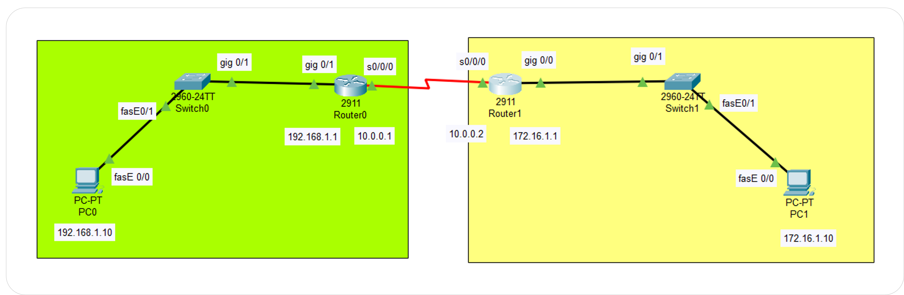

- **좌측 네트워크 (192.168.1.0/24)**

    - PC0 (192.168.1.10) 
    - Switch0
    - Router0 (192.168.1.1, Gateway)

- **우측 네트워크 (172.16.1.0/24)**

    - PC1 (172.16.1.10)
    - Switch1
    - Router1 (172.16.1.1, Gateway)

- **Router 간 연결 (WAN)**

    - Router0 ↔ Router1: Serial 0/0/0 포트로 연결

    - Router0: 10.0.0.1/30

    - Router1: 10.0.0.2/30

<br>

### 📌실습 과정 요약

```
1. PC 설정

2. Switch 생성

3. Router 설정

4. PC에 Gateway 입력

5. Ping 테스트

6. Router ↔ Router 연결시키기

7. Routing Table 만들기
```

<br>

## 1. PC 설정 

PC의 IP주소와 서브넷 마스크를 설정한다.

<br>

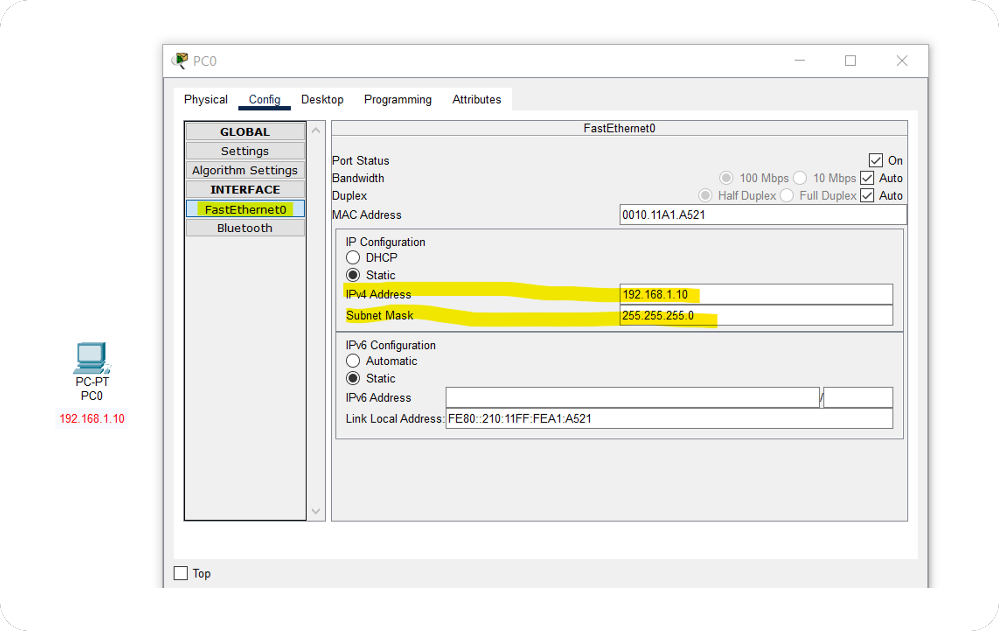

**1️⃣ PC0 선택 → Config 탭 → FastEthernet0 클릭**

Packet Tracer에서 PC는 여러 네트워크 인터페이스를 가질 수 있는데, 

기본적으로는 FastEthernet0 포트를 통해 스위치와 연결된다.

따라서 해당 인터페이스 메뉴에서만 IP 주소를 입력해야 실제 통신이 가능하다.

**2️⃣ IP Configuration → Static 선택**

DHCP 서버가 없으므로 직접 수동으로 입력한다.

**3️⃣ IPv4 Address & Subnet Mask 입력**

예: 192.168.1.10 / 255.255.255.0

이 설정을 통해 PC가 192.168.1.0/24 네트워크의 한 호스트로 인식된다.

<br>

## 2. Switch 생성

스위치는 데이터링크 계층에서 MAC 주소 기반으로 프레임을 전달하는 Layer 2 장비이다.

<br>

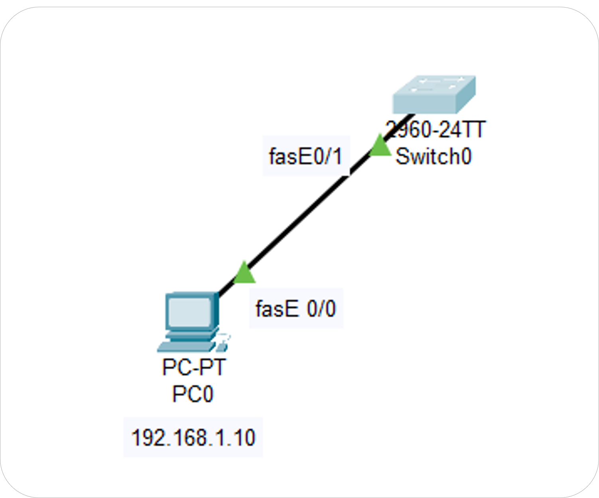

**▪ PC와 연결만 하면 통신 가능**

스위치는 단순히 '패킷 허브' 역할을 하기 때문에, 스위치 자체에 IP 주소가 없어도 동작할 수 있다.

**▪ 케이블 종류**

PC ↔ Switch 연결 시에는 **Straight-through Cable**을 사용한다.

서로 다른 계층 장비를 연결할 때는 직선 케이블을 사용한다.

<br>

## 3. Router 설정

라우터는 네트워크 계층에서 IP주소 기반으로 패킷을 전달하는 Layer 3 장비이다.

<br>

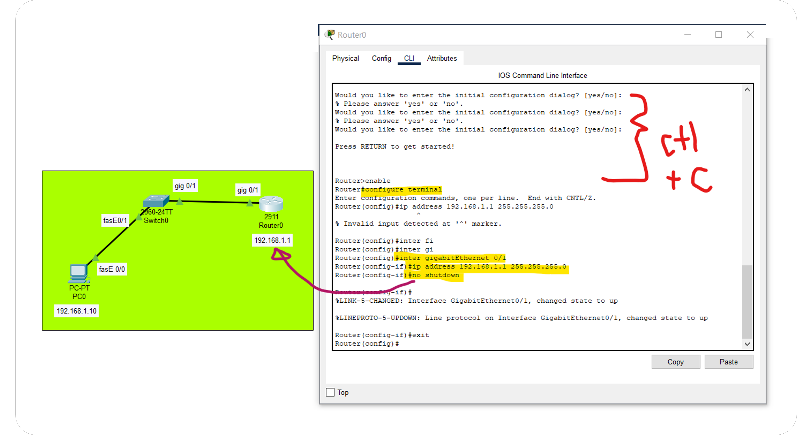

**▪ 라우터와 PC는 같은 네트워크에 있어야 통신 가능**

예: 192.168.1.0/24 네트워크에 PC0(192.168.1.10)와 Router0(192.168.1.1)을 두어야 직접 통신 가능하다.

**▪ Router 인터페이스에 IP 주소 할당**

라우터는 여러 네트워크를 연결하는 장비이므로, 각 네트워크에 속하는 **인터페이스에 IP를 부여**해야 한다.

PC ↔ Switch ↔ Router 구간에서는 Router의 **GigabitEthernet0/1** 인터페이스에 IP를 준다.

**▪ CLI 명령어**

```
Router> enable
Router# configure terminal
Router(config)# interface gigabitEthernet 0/1
Router(config-if)# ip address 192.168.1.1 255.255.255.0
Router(config-if)# no shutdown
Router(config-if)# exit
```

<br>

## 4. PC에 Gateway 입력

위에서 설정한 Router0이 PC0의 기본 게이트웨이가 된다.

<br>

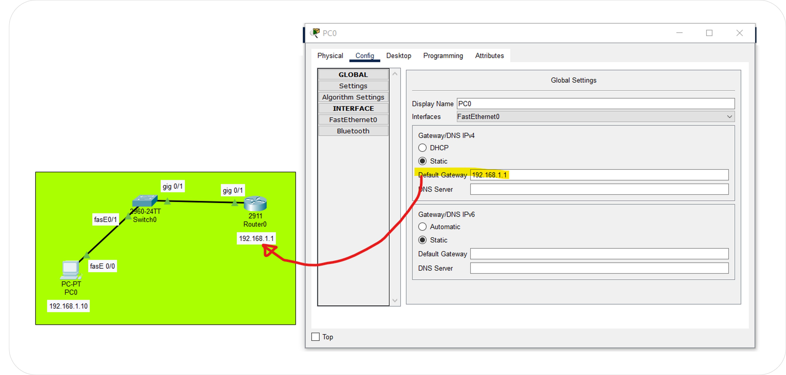

**▪ Default Gateway 설정**

PC0 설정 화면(Config → GLOBAL)에서 Default Gateway를 입력한다.

위에서 설정한 Router0의 IP(192.168.1.1) 이 PC0의 기본 게이트웨이가 된다.

이로써 PC0가 다른 네트워크로 나가는 패킷을 Router0로 먼저 보낼 수 있다.

<br>

## 5. Ping 테스트

PC0 → 라우터의 IP(192.168.1.1)로 Ping을 보내 통신 여부를 확인한다.

<br>

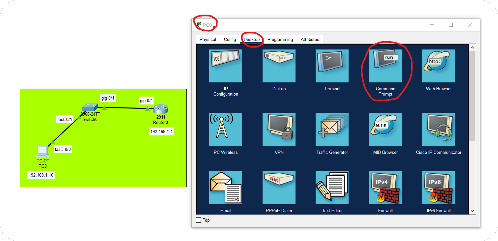

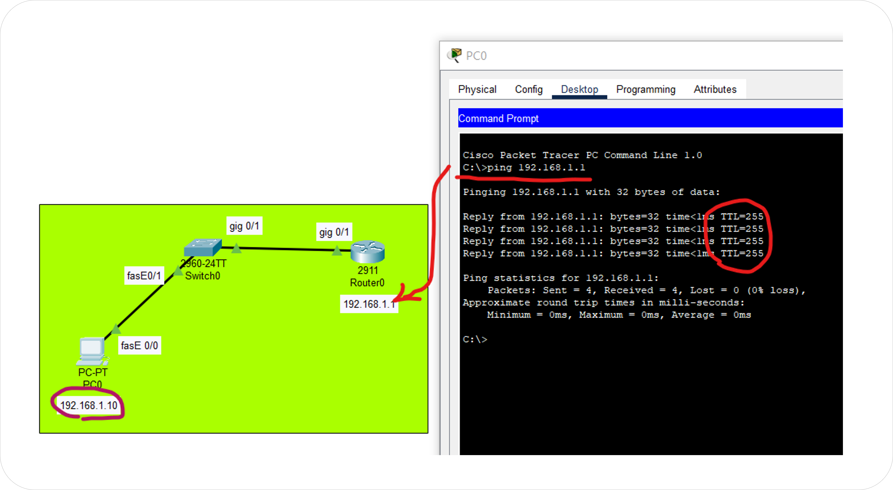

**▪ PC0에서 Desktop → Command Prompt 실행**

ping 192.168.1.1 입력 후 응답을 확인한다.

성공 시 PC0 ↔ Router0 간 연결이 정상적으로 이루어진 것이다.

<br>

## 6. Router ↔ Router 연결시키기

두 라우터를 WAN 구간에서 연결하기 위해 Serial 인터페이스를 사용한다.

<br>

### 6-0) 건너편 네트워크도 동일한 구조로 설계

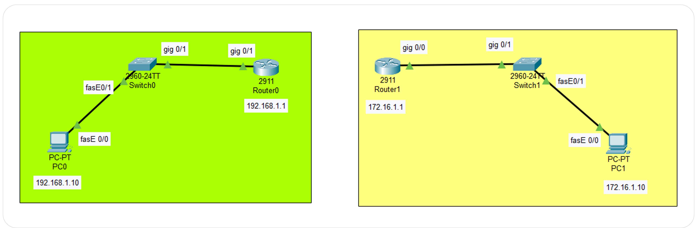

<br>

### 6-1) Router 간 연결은 Serial 인터페이스 사용

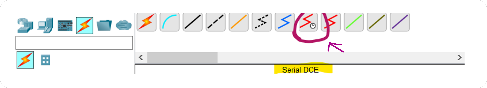

<br>

### 6-2) 각 라우터에 HWIC-2T 모듈 추가

Router의 Physical 탭에서 전원 끈 후 HWIC-2T 모듈 장착 → 전원 다시 켜기

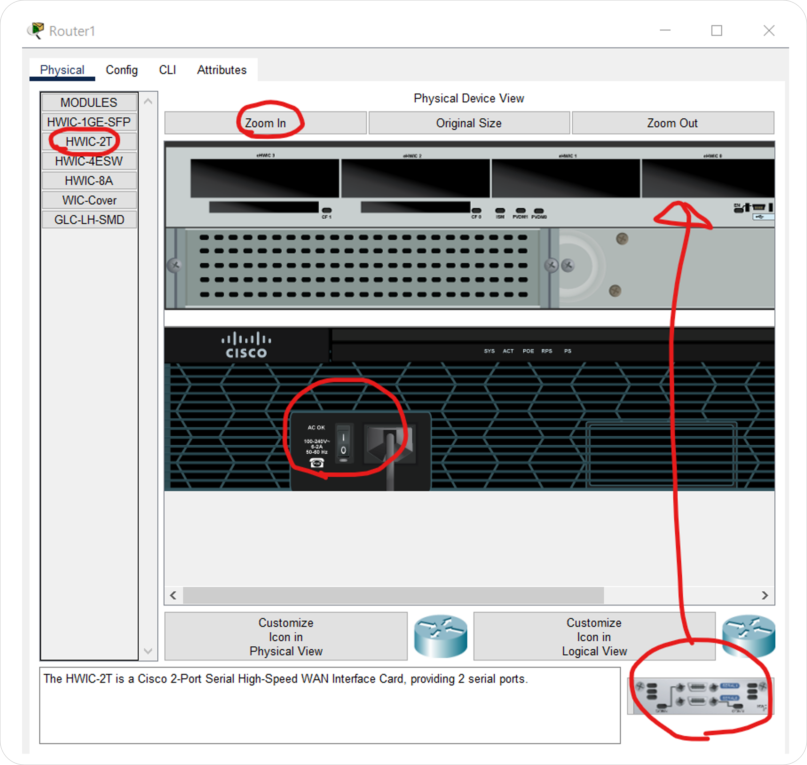

> [!IMPORTANT]
> ### Serial 인터페이스란? <br>
> \- WAN 구간에서 라우터 간 장거리 연결을 위해 사용하는 포트 <br> - 데이터가 직렬(Serial, 한 비트씩 순차 전송) 방식으로 흐르기 때문에 이런 이름이 붙음 <br> - Packet Tracer에서는 Serial0/0/0 같은 포트로 표시됨 <br><br> 
> ### HWIC-2T 모듈이란? 
> \- High-Speed WAN Interface Card (2-Port Serial) 의 약자 <br> - 라우터에 시리얼 포트를 추가해주는 확장 모듈 <br> - **기본 라우터에는 시리얼 포트가 없기 때문에, WAN 시뮬레이션을 하려면 반드시 장착해야 함**

<br>

### 6-3) Serial 포트 등장

HWIC-2T 모듈을 추가하면 라우터 인터페이스 목록에 Serial0/0/0과 같은 포트가 새로 나타난다.

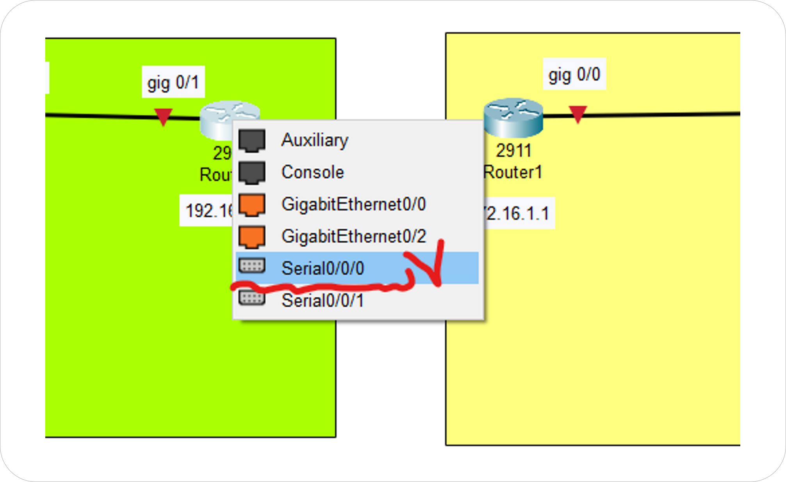

**▪ Serial0/0/0은 "슬롯 0 / 모듈 0 / 포트 0"을 의미**

이 포트를 선택해서 Router0 ↔ Router1을 연결하면 된다.

<br>

### 6-4) 라우터 간 Serial 포트 활성화 & IP 설정

라우터 간 연결을 위해 Serial 포트에 IP 주소와 Subnet Mask를 설정해야 한다.

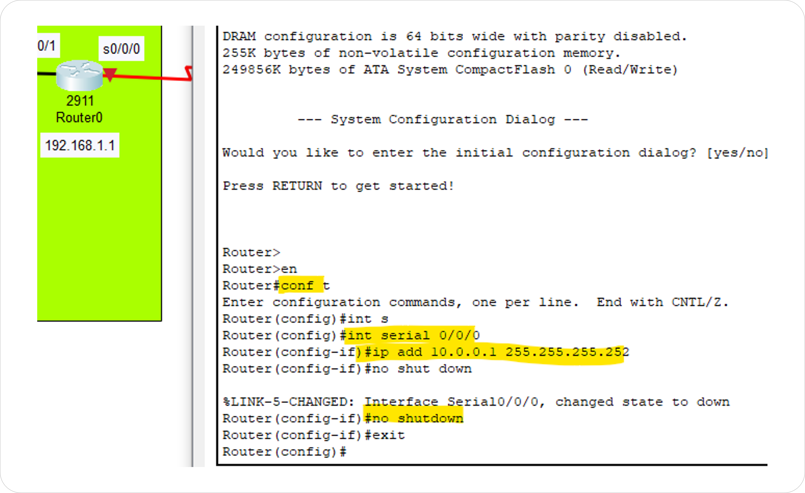

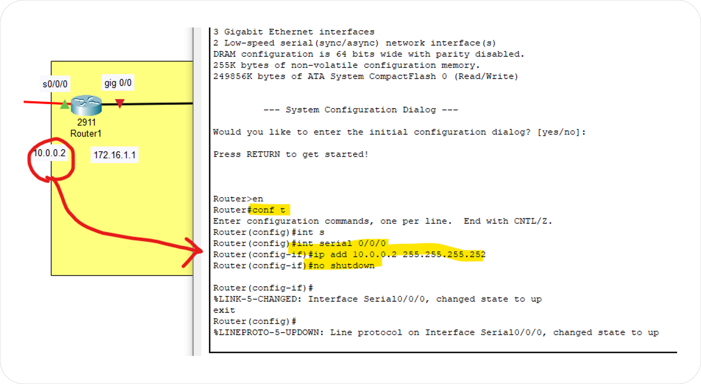

**▪ 기본적으로 인터페이스는 shutdown 상태이므로, no shutdown 명령어로 반드시 활성화**

Router는 LAN 쪽 IP와 WAN 쪽 Serial IP → 즉 **2개의 IP 주소**를 가지게 된다.

**▪ CLI 명령어**

```
// Router0 Serial 설정

Router0> enable
Router0# configure terminal
Router0(config)# interface serial 0/0/0       
Router0(config-if)# ip address 10.0.0.1 255.255.255.252  
Router0(config-if)# no shutdown             
Router0(config-if)# exit

// Router1 Serial 설정

Router1> enable
Router1# configure terminal
Router1(config)# interface serial 0/0/0       
Router1(config-if)# ip address 10.0.0.2 255.255.255.252   
Router1(config-if)# no shutdown             
Router1(config-if)# exit
```

